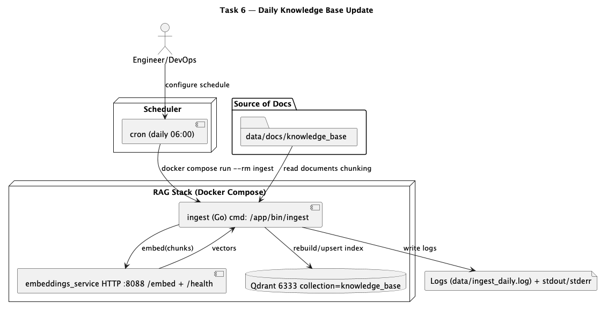

# Task 6 — Автоматическое ежедневное обновление базы знаний

Цель: полностью автоматизировать обновление векторного индекса при появлении новых/изменённых документов:
**источник → чанки → эмбеддинги → Qdrant → логи**.

В качестве “скрипта обновления” используется уже реализованный Go-компонент **ingest**
(контейнерная команда `docker compose run --rm ingest`).

---

## 1) Источник данных

Используется симулированный “живой” источник:
- локальная папка `data/docs/knowledge_base/`

Новые/изменённые документы “подхватываются” так:
- в папку добавляют или изменяют `.md/.txt` файлы
- ежедневный запуск ingest перечитывает документы и обновляет индекс в Qdrant

Поддерживаемые форматы: `*.md`, `*.txt`.

---

## 2) Обновление индекса (ingest)

Команда обновления:
```bash
docker compose run --rm ingest
```

Что делает ingest:
1. Читает документы из `data/docs/knowledge_base/`
2. Делит документы на чанки (настройки `CHUNK_SIZE`, `CHUNK_OVERLAP`)
3. Получает эмбеддинги через локальный `embeddings_service` (`/embed`)
4. Обновляет индекс в Qdrant (пересборка/перезапись индекса)
5. Пишет лог в stdout (время, размерность эмбеддингов, количество чанков, длительность)

Пример ожидаемой строки:
`Ingest completed. chunks=37 time=760ms`

---

## 3) Периодический запуск (cron)

Пример: каждый день в 06:00 (локальное время сервера)

crontab:
```bash
crontab -e
```

Добавь (указать корректный путь к репозиторию на машине, где крутится cron):
```cron
0 6 * * * cd /path/to/arc-ai-bot && docker compose run --rm ingest >> data/ingest_daily.log 2>&1
```

Поведение при ошибке:
- если ingest завершился с ошибкой — cron запишет stderr в `data/ingest_daily.log`
- по логам можно увидеть причину (например, недоступен Qdrant/embeddings)

---

## 4) Логирование

Используется логирование в stdout + файл лога cron (опционально):
- stdout/stderr ingest сохраняются в `data/ingest_daily.log` (если настроен cron-редирект)

Минимум, который фиксируется:
- время запуска (по timestamp в логе cron)
- размерность эмбеддингов (dim)
- количество чанков (chunks)
- длительность выполнения

---

## 5) Диаграмма 


