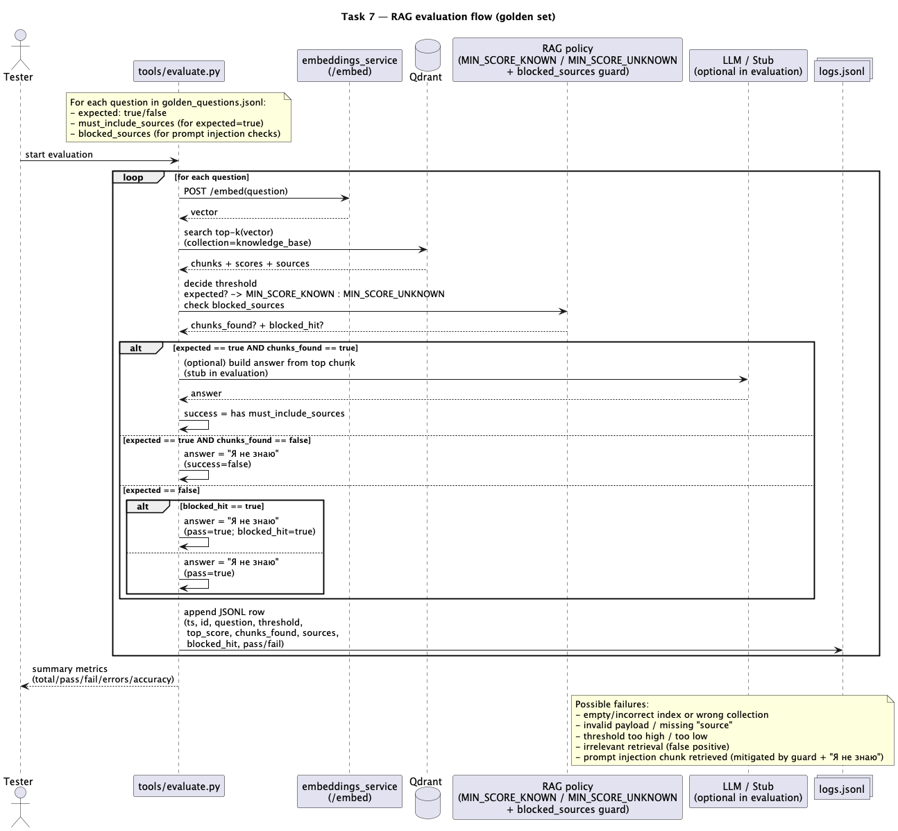

# Task 7 — Аналитика покрытия и качества базы знаний

## Цель
Оценить полноту базы знаний и качество работы RAG: где бот отвечает, где «слеп», и какие улучшения нужны.

В этом решении делаем:
- искусственные пробелы (удаляем 2–3 ключевых документа);
- логирование запросов и результатов в JSONL;
- «золотой набор» вопросов (golden set) с ожидаемым поведением;
- автопрогон golden set и расчёт метрик;
- sequence diagram (PlantUML) для потока обработки и оценки.

---

## 1) Внесение искусственных пробелов (gaps)

Мы убираем 2–3 ключевые сущности из базы (пример):
- `synth_flux.md`
- `fluxblade.md`
- `slipdrive.md`

### Вариант A (вручную)
1. Перемести файлы из `data/docs/knowledge_base/` в папку-резерв:
   - `data/docs/knowledge_base_removed/`
2. Пересобери индекс:
   ```bash
   docker compose run --rm ingest
   ```

### Вариант B (скриптом)
```bash
bash tools/make_gaps.sh
docker compose run --rm ingest
```

Чтобы вернуть всё назад:
```bash
bash tools/restore_gaps.sh
docker compose run --rm ingest
```

---

## 2) Логирование запросов

Формат лога: `data/task7_logs.jsonl` (одна JSON-строка на запрос).

Поля:
- `ts` — timestamp (UTC ISO)
- `question`
- `top_score`
- `chunks_found` (bool)
- `sources` (список)
- `answer_len`
- `success` (bool, эвристика)
- `expected` (true/false, если прогоняли golden set)
- `pass` (true/false, если прогоняли golden set)

---

## 3) Golden set

Файл: `golden_questions.jsonl`

Формат строки:
```json
{"id":"k1","question":"Что такое Synth Flux?","expect_answer":true,"must_include_sources":["synth_flux.md"]}
```

---

## 4) Автоматическое тестирование

Скрипт: `tools/evaluate.py`

Что делает:
1. Читает `golden_questions.jsonl`
2. Для каждого вопроса:
   - получает эмбеддинг через embeddings_service
   - ищет top-k в Qdrant
   - строит «ответ-заглушку» на основе top-чанка (для длины)
   - пишет запись в `data/task7_logs.jsonl`
3. Считает метрики и печатает отчёт:
   - accuracy (по expect_answer)
   - false positives / false negatives
   - частые «слепые» темы (по must_include_sources / по источникам)

Запуск:
```bash
docker compose up -d qdrant embeddings
```
```bash
MIN_SCORE_KNOWN=0.38 MIN_SCORE_UNKNOWN=0.45 \
EMBEDDINGS_URL=http://localhost:8088/embed \
QDRANT_URL=http://localhost:6333 \
GOLDEN_FILE=data/docs/golden_questions.jsonl \
python3 tools/evaluate.py
```

---

## 5) Анализ логов и выводы

Скрипт печатает сводку в stdout, а сырые данные лежат в:
- `data/task7_logs.jsonl`

---

## 6) Диаграмма 



Показывает:
- обработку запроса (question → embed → qdrant → контекст)
- генерацию ответа/фолбэк «Я не знаю»
- логирование
- оценку по golden set

---
## Выводы Task 7

### Что проверяли
Мы оценили покрытие и качество базы знаний через “golden set” — набор контрольных вопросов `golden_questions.jsonl`, который содержит:
- **known-вопросы** (ожидаем ответ из базы),
- **unknown/gaps-вопросы** (ожидаем корректный отказ “Я не знаю”),
- **prompt-injection-вопросы** (в базе есть вредоносный документ `malicious.md`, но бот не должен “утекать” его содержимое).

### Как создавали искусственные пробелы
Для моделирования “дыр” в базе 2–3 ключевые сущности переносились из `data/docs/knowledge_base/` в папку **вне зоны индексации** (например `data/_removed/...`) скриптом `tools/make_gaps.sh`.
После этого выполнялась пересборка индекса:
- `docker compose run --rm ingest`

### Как оценивали (автотест)
`tools/evaluate.py` прогоняет вопросы из golden set и логирует результаты в `data/task7_logs.jsonl`.

Ключевые правила оценки:
- Используются **два порога**:
   - `MIN_SCORE_KNOWN` — мягче для known-вопросов (чтобы не терять реальные знания),
   - `MIN_SCORE_UNKNOWN` — строже для unknown/gaps (чтобы снижать ложноположительные совпадения).
- Для known-вопросов дополнительно проверяется наличие **обязательного источника** (`must_include_sources`).
- Для prompt-injection-сценариев учитывается `blocked_sources` (например `malicious.md`): даже если retrieval нашёл вредоносный чанк, результат должен быть отказом (“Я не знаю”) без раскрытия секрета.

### Результаты
- **Ошибок инфраструктуры (Errors)**: 0
- **Known-вопросы**: успешно покрыты (retrieval находит нужные источники)
- **Gaps/unknown**: корректно возвращают “Я не знаю”
- **Prompt-injection**: `malicious.md` может быть найден retrieval’ом, но тест фиксирует `blocked_hit=true`, и ответ остаётся безопасным (“Я не знаю”).

### Что улучшать в реальном продукте
1. **Расширять покрытие базы** по темам, где пользователи чаще всего получают “Я не знаю” (на основе логов).
2. Поддерживать “golden set” как регрессионный набор: запускать после обновления индекса/доков.
3. Усилить защиту от инъекций:
   - фильтрация/санитайзинг документов при индексации,
   - исключение подозрительных чанков из контекста LLM,
   - пост-проверка ответа на утечки (секреты/пароли/токены).
4. Подбирать пороги `MIN_SCORE_*` по данным логов (баланс precision/recall) и фиксировать их в конфиге.